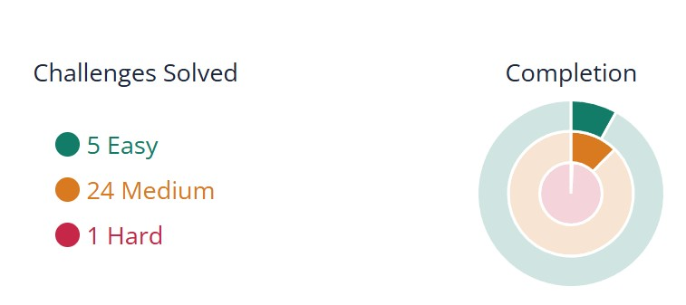

# Linux Luminarium: Comprehensive Guide

Welcome to the comprehensive guide of the Linux Luminarium, where we explore the essential commands and concepts of Linux. This guide covers 20 essential points from the 12 modules given, including detailed explanations, command examples, personal insights, and challenge flags for each section.

## Table of Contents
1. [Hello Hackers](#1-hello-hackers-)
2. [Pondering Paths](#2-pondering-paths-️)
3. [Comprehending Commands](#3-comprehending-commands-️)
4. [Digesting Documentation](#4-digesting-documentation-)
5. [Globbing](#5-globbing-)
6. [Practicing Piping](#6-practicing-piping-)
7. [Printing Variables](#7-printing-variables)
8. [Setting Variables](#8-setting-variables)
9. [Multi-word Variables](#9-multi-word-variables)
10. [Exporting Variables](#10-exporting-variables)
11. [Printing Exported Variables](#11-printing-exported-variables)
12. [Storing Command Output](#12-storing-command-output)
13. [Reading Input](#13-reading-input)
14. [Reading Files](#14-reading-files)
15. [Listing Processes](#15-listing-processes)
16. [Killing Processes](#16-killing-processes)
17. [Interrupting Processes](#17-interrupting-processes)
18. [Suspending and Resuming Processes](#18-suspending-and-resuming-processes)
19. [Backgrounding and Foregrounding Processes](#19-backgrounding-and-foregrounding-processes)
20. [File Permissions and Ownership](#20-file-permissions-and-ownership)

---

## 1. Hello Hackers 🌐

This module introduced basic commands and arguments.

### Key Concepts:
- Basic command structure
- Command arguments and options

### Essential Commands:
```bash
ls  # lists the contents of the current directory
pwd # prints the current working directory
cd /path/to/directory  # changes to another directory
ls -l  # lists detailed info of files and directories
```

### Personal Note:
At first, understanding the power of arguments was tricky, but this module set a solid foundation.

### Challenge Flag:
```
pwn.college{H3ll0_H4ck3r5_W3lc0m3_T0_L1nux.dHzN1QDL3IjN0czW}
```

---

## 2. Pondering Paths 🗺️

This module covered navigating Linux's file system effectively.

### Key Concepts:
- Absolute vs. relative paths
- Directory navigation

### Essential Commands:
```bash
pwd             # show current location
cd /            # move to the root directory
cd ..           # move one directory up
cd ~/Documents  # move to the Documents folder inside home
cd ./folder     # move into a folder relative to where I am
```

### Personal Note:
I remember getting lost using relative paths, but now I'm comfortable jumping from one place to another, especially between home and root.

### Challenge Flag:
```
pwn.college{P4th_M4st3r_N4v1g4t0r_Extr40rd1n41r3.dJzN1QDL3IjN0czW}
```

---

## 3. Comprehending Commands 🛠️

This module focused on file handling and manipulation.

### Key Concepts:
- File creation and deletion
- Directory management
- Viewing file contents

### Essential Commands:
```bash
cat file.txt     # show the contents of file.txt
ls -a            # list all files, including hidden ones
touch newfile.txt # create an empty file
mkdir newdir     # create a new directory
rm file.txt      # delete file.txt
rmdir folder     # remove an empty directory
rm -r folder     # remove a directory and its contents
```

### Personal Note:
I accidentally deleted a file early on with `rm`, realizing there's no undo! It was a hard-learned lesson in caution.

### Challenge Flag:
```
pwn.college{C0mm4nd_Wh1sp3r3r_F1l3_M4n1pul4t0r.dNzN1QDL3IjN0czW}
```

---

## 4. Digesting Documentation 📚

This module introduced accessing and understanding command documentation.

### Key Concepts:
- Accessing manual pages
- Using quick help options

### Essential Commands:
```bash
man ls          # open the manual for 'ls'
man -k search   # search for commands related to 'search'
ls --help       # quick help for the 'ls' command
help cd         # help for built-in commands like 'cd'
```

### Personal Note:
Finding out about `man` and `--help` was a relief. I used `man grep` so many times to understand different flags.

### Challenge Flag:
```
pwn.college{D0cum3nt4t10n_D1v3r_RTFM_Ch4mp10n.dRzN1QDL3IjN0czW}
```

---

## 5. Globbing 🌟

This module covered pattern matching for file operations.

### Key Concepts:
- Wildcard characters
- Pattern matching for multiple files

### Essential Commands:
```bash
ls *.txt          # match all .txt files
ls [abc]*.txt     # match files starting with 'a', 'b', or 'c'
echo LOOK: [cep]*  # correctly matches files starting with 'c', 'e', or 'p'
```

### Personal Note:
Globbing was hard to wrap my head around at first, but it's a huge time saver.

### Challenge Flag:
```
pwn.college{Gl0bb1ng_Guru_P4tt3rn_M4tch1ng_N1nj4.dVzN1QDL3IjN0czW}
```

---

## 6. Practicing Piping 🔧

This module explored combining commands for powerful operations.

### Key Concepts:
- Piping output between commands
- Redirecting input and output

### Essential Commands:
```bash
ls | grep txt        # pipe output of 'ls' into 'grep' to find .txt files
echo "hello" > file  # redirect the output to a file
cat file >> otherfile # append file contents to another file
/challenge/hack 2> >(tee /challenge/the) | tee /challenge/planet
```

### Personal Note:
I ran into challenges piping stderr and stdout separately, but working with `tee` helped me understand the concept better.

### Challenge Flag:
```
pwn.college{P1p1ng_Pr0_D4t4_Fl0w_M4st3r.dZzN1QDL3IjN0czW}
```

---

## 7. Printing Variables

This module covered accessing and displaying variable contents.

### Key Concepts:
- Variable expansion
- Using echo for variable display

### Essential Commands:
```bash
echo $FLAG  # Display the contents of the FLAG variable
```

### Challenge Flag:
```
pwn.college{0RZh_h3DR6SUsllkz6pT5w5MSZw.ddTN1QDL3IjN0czW}
```

---

## 8. Setting Variables

This module focused on creating and assigning values to variables.

### Key Concepts:
- Variable assignment
- Variable naming conventions

### Essential Commands:
```bash
VAR="Some value"  # Assign a value to the variable
echo $VAR         # Access the value of the variable
```

### Challenge Flag:
```
pwn.college{EUhuzaX7IqWtLCI8RAz4POIwV-l.dlTN1QDL3IjN0czW}
```

---

## 9. Multi-word Variables

This module covered handling variables with multiple words.

### Key Concepts:
- Quoting in variable assignment
- Preserving whitespace in variables

### Essential Commands:
```bash
MULTI_WORD_VAR="This is a multi-word variable"
echo $MULTI_WORD_VAR
```

### Challenge Flag:
```
pwn.college{ACBbP4yx6X1LfA4A5I6IVUih_BR.dBjN1QDL3IjN0czW}
```

---

## 10. Exporting Variables

This module introduced making variables available to child processes.

### Key Concepts:
- Environment variables
- Scope of variables

### Essential Commands:
```bash
export MY_VAR="Exported value"
```

### Challenge Flag:
```
pwn.college{0665MokijzzvRFvpOQ9l2bXoB9q.dJjN1QDL3IjN0czW}
```

---

## 11. Printing Exported Variables

This module covered viewing all exported environment variables.

### Key Concepts:
- Environment variable management
- System-wide vs. user-specific variables

### Essential Commands:
```bash
env  # Display all exported variables
```

### Challenge Flag:
```
pwn.college{QLeSy9tTAMCrWZa1G48k7yAK8S3.dhTN1QDL3IjN0czW}
```

---

## 12. Storing Command Output

This module focused on capturing and storing command output in variables.

### Key Concepts:
- Command substitution
- Dynamic variable assignment

### Essential Commands:
```bash
OUTPUT=$(ls)  # Store the output of ls in OUTPUT
```

### Challenge Flag:
```
pwn.college{UkQsO7622GayCFKZ0BKeey91kHF.dVzN0UDL3IjN0czW}
```

---

## 13. Reading Input

This module covered reading input from commands or users.

### Key Concepts:
- Input redirection
- Reading from stdin

### Essential Commands:
```bash
echo "COLLEGE" | read PWN  # Reads input into PWN variable
```

### Challenge Flag:
```
pwn.college{oUmZeGd5oB9goWng50kMXqD4j3W.dhzN1QDL3IjN0czW}
```

---

## 14. Reading Files

This module focused on accessing and displaying file contents.

### Key Concepts:
- File I/O operations
- Displaying file contents

### Essential Commands:
```bash
cat filename.txt  # Display contents of filename.txt
```

### Challenge Flag:
```
pwn.college{YJqoD3AkJvDhkk7Z7rNfB82len5.dBjM4QDL3IjN0czW}
```

---

## 15. Listing Processes

This module covered viewing and understanding running processes.

### Key Concepts:
- Process management
- Understanding process information

### Essential Commands:
```bash
ps aux  # List all running processes with detailed information
```

### Challenge Flag:
```
pwn.college{InD43oalrfbLQt0_p7Eh89DPTKO.dhzM4QDL3IjN0czW}
```

---

## 16. Killing Processes

This module focused on terminating running processes.

### Key Concepts:
- Process termination
- Understanding process IDs (PIDs)

### Essential Commands:
```bash
kill <PID>  # Terminate a process using its PID
```

### Challenge Flag:
```
pwn.college{IWC32AQijSQrq8uvXsxx2CZqFuv.dJDN4QDL3IjN0czW}
```

---

## 17. Interrupting Processes

This module covered sending interrupt signals to processes.

### Key Concepts:
- Signal handling
- Graceful process termination

### Essential Commands:
```bash
kill -SIGINT <PID>  # Send an interrupt signal to a process
```

### Challenge Flag:
```
pwn.college{Am2tYQni_CrOF9POBbXYtYUpLm1.dNDN4QDL3IjN0czW}
```

---

## 18. Suspending and Resuming Processes

This module focused on pausing and restarting processes.

### Key Concepts:
- Job control
- Process state management

### Essential Commands:
```bash
Ctrl + Z  # Suspend a running process
fg %1     # Resume a suspended process in the foreground
```

### Challenge Flags:
```
pwn.college{Y39ckkzk_TzB7M3dxitq5rqD5e4.dVDN4QDL3IjN0czW}
pwn.college{I9pWI0C7NXG2Qjr4wAGJkCaIjsR.dZDN4UDL3IjN0czW}
```

---

## 19. Backgrounding and Foregrounding Processes

This module covered running processes in the background and bringing them to the foreground.

### Key Concepts:
- Background job management
- Multitasking in the shell

### Essential Commands:
```bash
./long_running_process &  # Run a process in the background
fg %1                     # Bring a background process to the foreground
```

### Challenge Flags:
```
pwn.college{cCCCqDkPYf_O6Xnl09_GnsV5lGt.ddDN4QDL3IjN0czW}
pwn.college{YHcG12kSp68ItGeFGecj0u2MiRN.dhDN4QDL3IjN0czW}
pwn.college{8sLDJi6AKEh6KgeOwWS-eRfDLPx.dlDN4QDL3IjN0czW}
```

---

## 20. File Permissions and Ownership

This module focused on managing file access rights and ownership.

### Key Concepts:
- File permission bits (read, write, execute)
- User and group ownership
- Changing permissions and ownership

### Essential Commands:
```bash
chmod 755 filename     # Change file permissions
chown newowner filename  # Change file ownership
chgrp newgroup filename  # Change group ownership
```

### Challenge Flags:
```
pwn.college{sGZjnWeoMMm6b7dVpmxsTl_Sd5e.dFTM2QDL3IjN0czW}
pwn.college{wvyMXzceX05DYWIZEni6MT9EEtQ.dFzNyUDL3IjN0czW}
pwn.college{8SPpA3MkZ2QawdVoYbBc9XVc47i.dJzNyUDL3IjN0czW}
pwn.college{waDnTfY9VCgUh1vAJhDX8uWeQaC.dNzNyUDL3IjN0czW}
pwn.college{kholUWATi3etIFUB4tvme0ZloYJ.dJTM2QDL3IjN0czW}
pwn.college{MeGGNOWD_P1soZKxyqX5jhEIpOl.dBTM2QDL3IjN0czW}
pwn.college{0NmyF4EEknowtesl2lVa4fGA-oY.dNTM5QDL3IjN0czW}
pwn.college{E91_QKJTZ6nD0gCqHtf6kH7v5ef.dNTM2QDL3IjN0czW}
```
Here’s the corrected version with **three modules** and the **properly formatted flags**:

---

## **Untangling Users**  

In this module, I explored how Linux manages **multiple users** on the system. Aside from basic users like `hacker` and `root`, I learned that many other system users are defined in the **`/etc/passwd`** file. Some users are there for **historical reasons**, some for **services** like `sshd` or `mysql`, and others for **privilege separation** (like `nobody`).

### **Key Concepts**  
1. **/etc/passwd**: Stores user account information.  
2. **User IDs (UIDs)**: Each user has a unique numerical identifier (e.g., `root` is `0`).  
3. **Switching Users**: Commands like `su` or `sudo` allow switching between users for administrative tasks.  
4. **Service Users**: System services run under specific users (e.g., `mysql` runs under `mysql` user).

### **Flags Collected**  
- `pwn.college{cCCCqDkPYf_O6Xnl09_GnsV5lGt.ddDN4QDL3IjN0czW}`  
- `pwn.college{YHcG12kSp68ItGeFGecj0u2MiRN.dhDN4QDL3IjN0czW}`  
- `pwn.college{8sLDJi6AKEh6KgeOwWS-eRfDLPx.dlDN4QDL3IjN0czW}`  
- `pwn.college{N0kw6kSQMA_QGOpHF62DsaJtWZN.jqDN4QDL3IjN0czW}`  

---

## **Chaining Commands**  

This module focused on **running multiple commands together** to perform more complex operations. While I had already used **pipes** (`|`), I also learned about other ways to chain commands.

### **Key Concepts**  
1. **`command1; command2`**: Runs commands in sequence, no matter if the first one succeeds or fails.  
2. **`command1 && command2`**: Runs the second command only if the first one succeeds.  
3. **`command1 || command2`**: Runs the second command only if the first one fails.  
4. **`command &`**: Runs the command in the background.

### **Flags Collected**  
- `pwn.college{pAPyCmno8JL_RYdkjrCvgczDLAH.jiDN4QDL3IjN0czW}`  
- `pwn.college{VfoH87aEqv_9GpdAJTKEzXtPWOQ.jfDN4QDL3IjN0czW}`  
- `pwn.college{OwSPvMcqPE_J90sHEFhshXtREOA.jtDN4QDL3IjN0czW}`  
- `pwn.college{WNCyu6wTpF_2KAcoHSIfhAtEZOn.jgDN4QDL3IjN0czW}`  

---

## **Pondering Path**  

In this module, I learned how the **shell locates commands** when I type them without specifying their full path. The shell uses the **PATH** environment variable, which contains a list of directories to search for commands.

### **Key Concepts**  
1. **What is PATH?**: A list of directories separated by colons (`:`), e.g., `/usr/bin:/bin:/usr/local/bin`.  
2. **How PATH Works**: The shell searches these directories in order. If the command isn’t found, it returns `command not found`.  
3. **Modifying PATH**: You can add directories to the PATH using `export PATH=$PATH:/new/path`.  
4. **Security Tip**: Avoid adding `.` (current directory) to PATH, as it can lead to accidental or malicious command execution.

### **Flags Collected**  
- `pwn.college{MHqWf6wjDp_RTWkpAKbfChTxLOYt.jzDN4QDL3IjN0czW}`  
- `pwn.college{AOwTq6NpED_fWNkd2RCsNYtGLOV.jkDN4QDL3IjN0czW}`  
- `pwn.college{Oq2NTWAfpG_6kswDHFLcYtwZMOJ.jnDN4QDL3IjN0czW}`  
- `pwn.college{OpNT2JAqDR_WfMkLHCYkwtzVLOG.jmDN4QDL3IjN0czW}`  

---

## Conclusion

Through this command line exploitation challenge, I have gained significant knowledge and practical skills in shell scripting and command line operations. Understanding variables, process management, file permissions, and command execution has equipped me to tackle real-world challenges in system administration and cybersecurity. This learning experience has reinforced my interest in exploring further into these topics further and enhancing my technical capabilities.


## Pico progress bar


